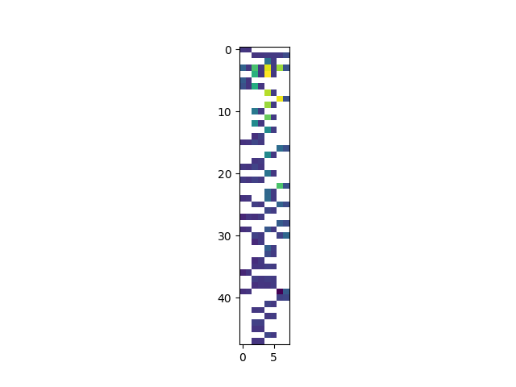
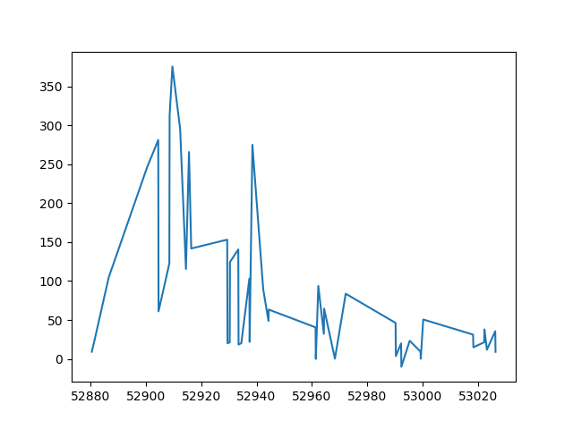
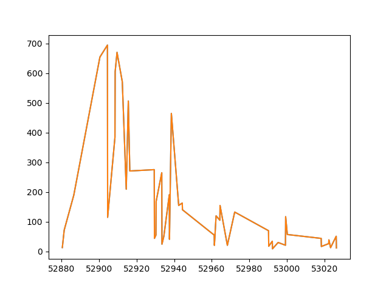
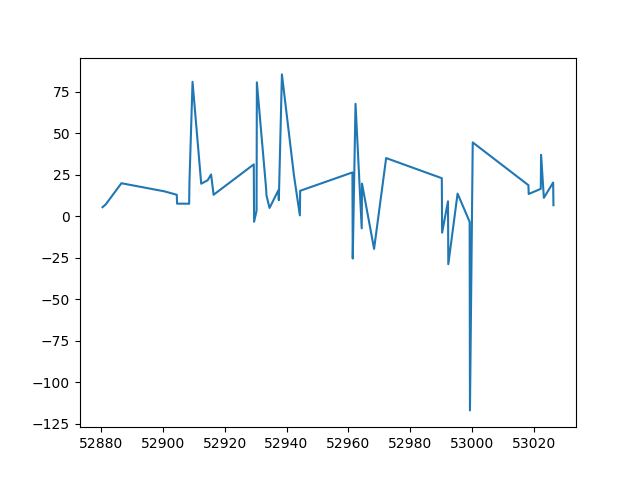
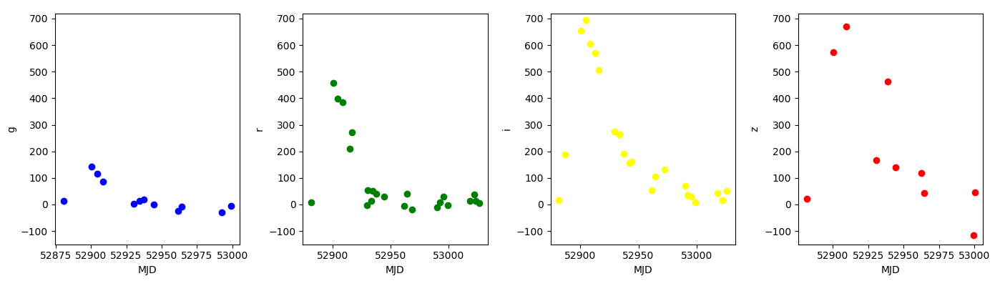

---
title: Analyzing Supernova Data
teaching: 30
exercises: 10
questions:
- "How can I process create simple plots in Python?"
objectives:
- "Plot simple graphs from data."
keypoints:
- "Use the `pyplot` library from `matplotlib` for creating simple visualizations."
---

## Visualizing data

The mathematician Richard Hamming once said, "The purpose of computing is insight, not numbers," and
the best way to develop insight is often to visualize data.  Visualization deserves an entire
lecture of its own, but we can explore a few features of Python's `matplotlib` library here.  While
there is no official plotting library, `matplotlib` is the _de facto_ standard.  First, we will
import the `pyplot` module from `matplotlib` and use two of its functions to create and display a
heat map of our data:

~~~
import matplotlib.pyplot
image = matplotlib.pyplot.imshow(data[:,1:])
matplotlib.pyplot.show()
~~~
{: .language-python}

Blue pixels in this heat map represent low values, while yellow pixels represent high values.  As we
can see, flux rises and falls over a length of the observation period.

> ## Some IPython Magic
>
> If you're using a Jupyter notebook,
> you'll need to execute the following command
> in order for your matplotlib images to appear
> in the notebook when `show()` is called:
>
> ~~~
> %matplotlib inline
> ~~~
> {: .language-python}
>
> The `%` indicates an IPython magic function -
> a function that is only valid within the notebook environment.
> Note that you only have to execute this function once per notebook.
{: .callout}

Let's take a look at the average flux over time:

~~~
ave_flux = numpy.nanmean(data[:,1:], axis=1)
mjd = data[:,0]
ave_plot = matplotlib.pyplot.plot(mjd, ave_flux)
matplotlib.pyplot.show()
~~~
{: .language-python}

Here, we have put the average flux per day in the variable `ave_flux` and the Modified 
Julian Date in the variable 'mjd'. Then we
asked `matplotlib.pyplot` to create and display a line graph of those two variable.  The result is a
fast rise and slow fall but it is very jagged.  Let's have a look at two other statistics:

~~~
max_plot = matplotlib.pyplot.plot(mjd, numpy.nanmax(data[:,1:], axis=1))
matplotlib.pyplot.show()
~~~
{: .language-python}

~~~
min_plot = matplotlib.pyplot.plot(mjd,numpy.nanmin(data[:,1:], axis=1))
matplotlib.pyplot.show()
~~~
{: .language-python}

The maximum value rises and falls, while the minimum seems to be pretty flat. Of course, here we are averaging over 
several different bands and observations are only available for a subset of the bands for each date. It would be much better to look at the individual lightcurves for each band.

~~~
matplotlib.pyplot.plot(mjd,data[:,1],'o', color='blue')
matplotlib.pyplot.plot(mjd,data[:,3],'o', color='green')
matplotlib.pyplot.plot(mjd,data[:,5],'o', color='yellow')
matplotlib.pyplot.plot(mjd,data[:,7],'o', color='red')
matplotlib.pyplot.show()
~~~
{: .language-python}

### Grouping plots
You can group similar plots in a single figure using subplots.
This script below uses a number of new commands. The function `matplotlib.pyplot.figure()`
creates a space into which we will place all of our plots. The parameter `figsize`
tells Python how big to make this space. Each subplot is placed into the figure using
its `add_subplot` [method]({{ page.root }}/reference/#method). The `add_subplot` method takes 3
parameters. The first denotes how many total rows of subplots there are, the second parameter
refers to the total number of subplot columns, and the final parameter denotes which subplot
your variable is referencing (left-to-right, top-to-bottom). Each subplot is stored in a
different variable (`axes1`, `axes2`, `axes3`). Once a subplot is created, the axes can
be titled using the `set_xlabel()` command (or `set_ylabel()`).
Here are our three plots side by side:

~~~
import numpy as np
import matplotlib.pyplot as plt

data = np.loadtxt(fname='data/03D1ar.csv', delimiter=',', skiprows=1)
mjd = data[:,0]

fig = plt.figure(figsize=(15.0, 4.0))

axes1 = fig.add_subplot(1, 4, 1)
axes2 = fig.add_subplot(1, 4, 2)
axes3 = fig.add_subplot(1, 4, 3)
axes4 = fig.add_subplot(1, 4, 4)

axes1.set_xlabel('MJD')
axes1.set_ylabel('g')
axes1.set_ylim([-150,720])
axes1.plot(mjd,data[:,1],'o', color='blue')

axes2.set_xlabel('MJD')
axes2.set_ylabel('r')
axes2.set_ylim([-150,720])
axes2.plot(mjd,data[:,3],'o', color='green')

axes3.set_xlabel('MJD')
axes3.set_ylabel('i')
axes3.set_ylim([-150,720])
axes3.plot(mjd,data[:,5],'o', color='yellow')

axes4.set_xlabel('MJD')
axes4.set_ylabel('z')
axes4.set_ylim([-150,720])
axes4.plot(mjd, data[:,7],'o', color='red')

fig.tight_layout()

plt.show(block=False)
~~~
{: .language-python}

The [call]({{ page.root }}/reference/#function-call) to `loadtxt` reads our data,
and the rest of the program tells the plotting library
how large we want the figure to be,
that we're creating three subplots,
what to draw for each one,
and that we want a tight layout.
(If we leave out that call to `fig.tight_layout()`,
the graphs will actually be squeezed together more closely.)
